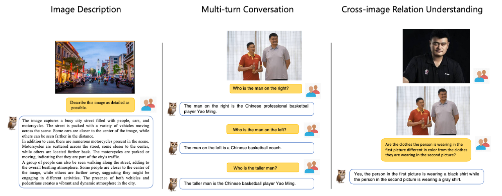
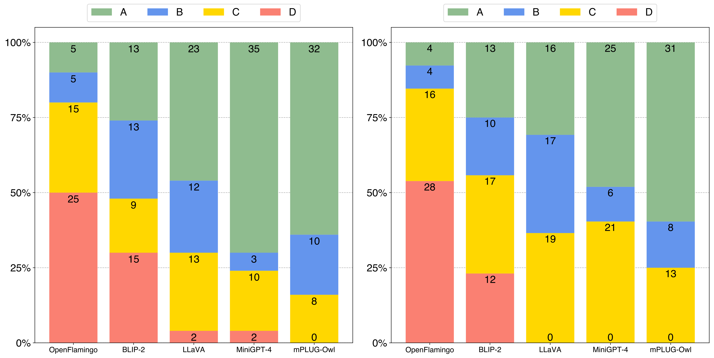

<div align="center">

</div>

# mPLUG-Owl🦉: Modularization Empowers Large Language Models with Multimodality
<div align="center">
Qinghao Ye*, Haiyang Xu*, Guohai Xu*, Jiabo Ye, Ming Yan†, Yiyang Zhou, Junyang Wang, Anwen Hu, Pengcheng Shi, Yaya Shi, Chaoya Jiang, Chenliang Li, Yuanhong Xu, Hehong Chen, Junfeng Tian, Qian Qi, Ji Zhang, Fei Huang
</div>
<div align="center">
<strong>DAMO Academy, Alibaba Group</strong>
</div>
<div align="center">
*Equal Contribution; † Corresponding Author
</div>

<div align="center">
    <a href="https://huggingface.co/spaces/MAGAer13/mPLUG-Owl"></a>
    <a href="https://modelscope.cn/studios/damo/mPLUG-Owl/summary"></a>
    <a href="https://github.com/X-PLUG/mPLUG-Owl/blob/main/LICENSE"></a>
    <a href="http://mm-chatgpt.oss-cn-zhangjiakou.aliyuncs.com/mplug_owl_demo/released_checkpoint/mPLUG_Owl_paper.pdf"></a>
    <a href="https://arxiv.org/abs/2304.14178"></a>
    <a href="https://hits.seeyoufarm.com"></a>
</div>
<!--
[](https://huggingface.co/spaces/MAGAer13/mPLUG-Owl)
[](https://modelscope.cn/studios/damo/mPLUG-Owl/summary)
[](https://github.com/X-PLUG/mPLUG-Owl/blob/main/LICENSE)
[](http://mm-chatgpt.oss-cn-zhangjiakou.aliyuncs.com/mplug_owl_demo/released_checkpoint/mPLUG_Owl_paper.pdf)
[](https://arxiv.org/abs/2304.14178)
[](https://hits.seeyoufarm.com)
-->
<div align="center">
<a href="#">English</a> | <a href="README_zh.md">简体中文</a>
<hr>
</div>

<!--
English | [简体中文](README_zh.md)
<hr>
-->

<div align="center">

</div>

## Examples



## News

* We released code and dataset for instruction tuning.
* Online demo on [HuggingFace](https://huggingface.co/spaces/MAGAer13/mPLUG-Owl) is available. Thank Huggingface for providing us with free computing resources!
* Online demo on HuggingFace now supports recieve video! Demo on ModelScope will support soon.
* We upload our visually-related evaluation set **OwlEval**.
* We provide an [online demo](https://modelscope.cn/studios/damo/mPLUG-Owl/summary) on modelscope for the public to experience.
* We released code of mPLUG-Owl🦉 with its pre-trained and instruction tuning checkpoints.

## Spotlights
* A new training paradigm with a **modularized design** for large multi-modal language models.
* Learns visual knowledge while support **multi-turn conversation** consisting of different modalities.
* Observed abilities such as **multi-image correlation** and **scene text understanding**, **vision-based document comprehension**.
* Release a visually-related instruction evaluation set **OwlEval**.
* Our outstanding works on modularization:
  * [E2E-VLP](https://aclanthology.org/2021.acl-long.42/), [mPLUG](https://aclanthology.org/2022.emnlp-main.488/) and [mPLUG-2](https://arxiv.org/abs/2302.00402), were respectively accepted by ACL 2021, EMNLP 2022 and ICML 2023.
  * [mPLUG](https://aclanthology.org/2022.emnlp-main.488/) is the first to achieve the human parity on VQA Challenge.
* comming soon
  - [ ] Publish on Huggingface Hub
  - [ ] Multi-lingustic support (e.g., Chinese, Japanese, Germen, French, etc.)
  - [ ] Instruction tuning on interleaved data (multiple images and videos).
  - [x] Huggingface space demo.
  - [x] Instruction tuning code and pre-training code.
  - [x] A visually-related evaluation set **OwlEval** to comprehensively evaluate various models.
  


## Online Demo
### ModelScope
<a href="https://www.modelscope.cn/studios/damo/mPLUG-Owl/summary"></a>

### Hugging Face
<!-- [](https://www.modelscope.cn/studios/damo/mPLUG-Owl/summary) -->

[](https://huggingface.co/spaces/MAGAer13/mPLUG-Owl)

<!--  -->

## Checkpoints
|Model|Phase|Download link|
|-|-|-|
|mPLUG-Owl 7B|Pre-training|[Download link](http://mm-chatgpt.oss-cn-zhangjiakou.aliyuncs.com/mplug_owl_demo/released_checkpoint/pretrained.pth)|
|mPLUG-Owl 7B|Instruction tuning|[Download link](http://mm-chatgpt.oss-cn-zhangjiakou.aliyuncs.com/mplug_owl_demo/released_checkpoint/instruction_tuned.pth)|
|Tokenizer model|N/A|[Download link](http://mm-chatgpt.oss-cn-zhangjiakou.aliyuncs.com/mplug_owl_demo/released_checkpoint/tokenizer.model)|

## OwlEval
The evaluation dataset OwlEval can be found in ```./OwlEval```.

## Usage
### Install Requirements
Core library dependency:
* PyTorch=1.13.1 (1.13.1 is required by the peft)
* transformers=4.28.1
* [Apex](https://github.com/NVIDIA/apex)
* einops
* icecream
* flask
* ruamel.yaml
* uvicorn 
* fastapi
* markdown2
* gradio
* sconf
* tensorboardX
* tensorboard
* h5py
* sentencepiece
* peft

You can also refer to the exported Conda environment configuration file ```env.yaml``` to prepare your environments.

Apex needs to be manually compiled from source code, because mPLUG-Owl rely on the its cpp extension (MixedFusedLayerNorm).

Considering that the code in the apex repository changes frequently, we have included a fixed copy of the apex in our repository, which can be installed using the following command:
```shell
cd apex_22.01_pp
TORCH_CUDA_ARCH_LIST='5.2 6.0 6.1 7.0 7.5 8.0 8.6' pip install -v --disable-pip-version-check --no-cache-dir --global-option="--cpp_ext" --global-option="--cuda_ext" ./
```

We will remove the dependency on apex in the next version.

### Local Demo
We provide a script to deploy a simple demo in your local machine.
```Bash
python -m server_mplug.owl_demo --debug --port 6363 --checkpoint_path 'your checkpoint path' --tokenizer_path 'your tokenizer path'
```
### Inference
Build model, toknizer and processor.
```Python
from interface import get_model
model, tokenizer, img_processor = get_model(
        checkpoint_path='checkpoint path', tokenizer_path='tokenizer path')
```
Prepare model inputs.
```Python
# We use a human/AI template to organize the context as a multi-turn conversation.
# <image> denotes an image placehold.
prompts = [
'''The following is a conversation between a curious human and AI assistant. The assistant gives helpful, detailed, and polite answers to the user's questions.
Human: <image>
Human: Explain why this meme is funny.
AI: ''']

# The image paths should be placed in the image_list and kept in the same order as in the prompts.
# We support urls, local file paths and base64 string. You can custom the pre-process of images by modifying the mplug_owl.modeling_mplug_owl.ImageProcessor
image_list = ['https://xxx.com/image.jpg',]
```

For multiple images inputs, as it is an emergent ability of the models, we do not know which format is the best. Below is an example format we have tried in our experiments. Exploring formats that can help models better understand multiple images could be beneficial and worth further investigation.
```Python
prompts = [
'''The following is a conversation between a curious human and AI assistant. The assistant gives helpful, detailed, and polite answers to the user's questions.
Human: <image>
Human: <image>
Human: Do the shirts worn by the individuals in the first and second pictures vary in color? If so, what is the specific color of each shirt?
AI: ''']

image_list = ['https://xxx.com/image_1.jpg', 'https://xxx.com/image_2.jpg']
```

Get response.
```Python
# generate kwargs (the same in transformers) can be passed in the do_generate()
from interface import do_generate
sentence = do_generate(prompts, image_list, model, tokenizer,
                               img_processor, max_length=512, top_k=5, do_sample=True)
```
### Instruction Tuning
The training samples are stored in ```xxx.jsonl``` and orgnized in the following format:
```json
{"text": "The following is a conversation between a curious human and AI assistant. The assistant gives helpful, detailed, and polite answers to the user's questions.\nHuman: Construct a sentence using the given verb in the past tense\nshudder\nAI: She shuddered at the thought of being alone in the dark.", "task_type": "gpt4instruct_sft"}
{"image": ["xxx.jpg"], "text": "The following is a conversation between a curious human and AI assistant. The assistant gives helpful, detailed, and polite answers to the user's questions.\nHuman: <image>\nHuman: Where is the man located in the image?\nAI: The man is located in a small restaurant, sitting and enjoying his meal.\nHuman: What type of food is the man eating in the image?\nAI: The man is eating a burrito in the image.\nHuman: What can be seen next to the man in the restaurant?\nAI: Next to the man in the restaurant, there is a fridge filled with cans of soda.\nHuman: How does the man feel as he is about to eat his meal?\nAI: The man looks happy and is smiling as he is about to take a bite of his meal.\nHuman: What unique aspect of the photo makes the scene appear distorted or unusual?\nAI: The unique aspect of this photo is that it was taken using a fish-eye lens, which creates a distorted, wide-angle view of the scene, making it appear different from a standard perspective.", "task_type": "llava_sft"}
```
The ```task_type``` can be in one of ```{'quora_chat_sft', 'sharegpt_chat_sft', 'llava_sft', 'gpt4instruct_sft'}```.

Prepare your own train.jsonl and dev.jsonl and modify ```data_files``` in ```configs/instruction_tuning/v0.yaml```.

Put downloaded ```pretrained.pth``` in the root folder.

Execute the training script.
```
bash train_it.sh
```
## Performance Comparison
The comparison results of 50 single-turn responses (left) and 52 multi-turn responses (right) between mPLUG-Owl and baselines with manual evaluation metrics. A/B/C/D denote the rate of each response.



## Related Projects

* [LLaMA](https://github.com/facebookresearch/llama). A open-source collection of state-of-the-art large pre-trained language models.
* [Baize](https://github.com/project-baize/baize-chatbot). An open-source chat model trained with LoRA on 100k dialogs generated by letting ChatGPT chat with itself.
* [Alpaca](https://github.com/tatsu-lab/stanford_alpaca). A fine-tuned model trained from a 7B LLaMA model on 52K instruction-following data.
* [LoRA](https://github.com/microsoft/LoRA). A plug-and-play module that can greatly reduce the number of trainable parameters for downstream tasks.
* [MiniGPT-4](https://github.com/Vision-CAIR/MiniGPT-4). A multi-modal language model that aligns a frozen visual encoder with a frozen LLM using just one projection layer.
* [LLaVA](https://github.com/haotian-liu/LLaVA). A visual instruction tuned vision language model which achieves GPT4 level capabilities.
* [mPLUG](https://github.com/alibaba/AliceMind/tree/main/mPLUG). A vision-language foundation model for both cross-modal understanding and generation.
* [mPLUG-2](https://github.com/alibaba/AliceMind). A multimodal model with a modular design, which inspired our project.

## Citation
If you found this work useful, consider giving this repository a star and citing our paper as followed:
```
@misc{ye2023mplugowl,
      title={mPLUG-Owl: Modularization Empowers Large Language Models with Multimodality}, 
      author={Qinghao Ye and Haiyang Xu and Guohai Xu and Jiabo Ye and Ming Yan and Yiyang Zhou and Junyang Wang and Anwen Hu and Pengcheng Shi and Yaya Shi and Chaoya Jiang and Chenliang Li and Yuanhong Xu and Hehong Chen and Junfeng Tian and Qian Qi and Ji Zhang and Fei Huang},
      year={2023},
      eprint={2304.14178},
      archivePrefix={arXiv},
      primaryClass={cs.CL}
}
```
