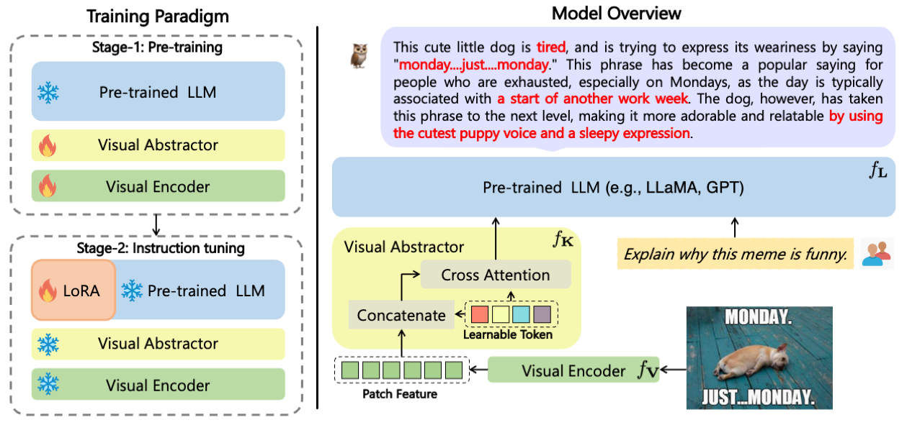

# mPLUG-Owl🦉: Modularization Empowers Large Language Models with Multimodality
Qinghao Ye*, Haiyang Xu*, Guohai Xu*, Jiabo Ye, Ming Yan†, Yiyang Zhou, Junyang Wang, Anwen Hu, Pengcheng Shi, Yaya Shi, Chenliang Li, Yuanhong Xu, Hehong Chen, Junfeng Tian, Qian Qi, Ji Zhang, Fei Huang

**阿里巴巴集团，达摩院**

*Equal Contribution; † Corresponding Author

[](https://modelscope.cn/studios/damo/mPLUG-Owl/summary)
[](https://github.com/X-PLUG/mPLUG-Owl/blob/main/LICENSE)
[](http://mm-chatgpt.oss-cn-zhangjiakou.aliyuncs.com/mplug_owl_demo/released_checkpoint/mPLUG_Owl_paper.pdf)
[](https://arxiv.org/abs/2304.14178)

[English](README.md) | 简体中文
<hr>


## 示例


## 最新更新

* 我们在Modelscope上提供了一个[在线Demo](https://modelscope.cn/studios/damo/mPLUG-Owl/summary)供大家体验。
* 我们开放了mPLUG-Owl🦉，以及推理代码和二阶段微调参数。

## 亮点特色
* 一种面向多模态语言模型的模块化的训练范式。
* 能学习与语言空间相适应的视觉知识，并支持在多模态场景下进行多轮对话。
* 涌现多图关系理解，场景文本理解和基于视觉的文档理解等能力。
* 提出了针对视觉相关指令的测评集**OwlEval**，用以评估多模态语言模型的对带有视觉信息上下文的理解能力。



## 在线Demo
[ModelScope平台上的在线Demo](https://www.modelscope.cn/studios/damo/mPLUG-Owl/summary)


## 预训练参数
|Model|Phase|Download link|
|-|-|-|
|mPLUG-Owl 7B|Pre-training|[下载链接](http://mm-chatgpt.oss-cn-zhangjiakou.aliyuncs.com/mplug_owl_demo/released_checkpoint/pretrained.pth)|
|mPLUG-Owl 7B|Instruction tuning|[下载链接](http://mm-chatgpt.oss-cn-zhangjiakou.aliyuncs.com/mplug_owl_demo/released_checkpoint/pretrained.pth)|
|Tokenizer model|N/A|[下载链接](http://mm-chatgpt.oss-cn-zhangjiakou.aliyuncs.com/mplug_owl_demo/released_checkpoint/tokenizer.model)|
## 使用
### 安装依赖
核心组件:
* PyTorch=1.12.1
* transformers=4.28.1
* [Apex](https://github.com/NVIDIA/apex)
* einops
* icecream
* flask
* ruamel.yaml
* uvicorn 
* fastapi
* markdown2
* gradio

你也可以根据我们导出的```env.yaml```来准备你的环境。

### 本地部署Demo
我们提供了一个易扩展的脚本来一键部署本地Demo，你可以根据自己的需求进行修改。
```Bash
python -m server_mplug.owl_demo --debug --port 6363 --checkpoint_path 'your checkpoint path' --tokenizer_path 'your tokenizer path'
```
### 推理
如果要实现自定义的推理，可以参考以下步骤。

构建model, tokenizer, img_processor
```Python
from interface import get_model
model, tokenizer, img_processor = get_model(
        checkpoint_path='checkpoint path', tokenizer_path='tokenizer path')
```
准备模型输入
```Python
# We use a human/AI template to organize the context as a multi-turn conversation.
# <image> denotes an image placehold.
prompts = [
'''The following is a conversation between a curious human and AI assistant. The assistant gives helpful, detailed, and polite answers to the user's questions.
Human: <image>
Human: Explain why this meme is funny.
AI: ''']

# The image paths should be placed in the image_list and kept in the same order as in the prompts.
# We support urls, local file paths and base64 string. You can custom the pre-process of images by modifying the mplug_owl.modeling_mplug_owl.ImageProcessor
image_list = ['https://xxx.com/image.jpg',]
```

对于多张图片，由于这是模型涌现的能力（训练数据并不包含多图的样本），我们并不知道何种格式对模型而言是最佳的。下面是我们在实验中所使用的格式。大家也可以自行探索能让模型更好理解多图关系的格式或者prompt。
```Python
prompts = [
'''The following is a conversation between a curious human and AI assistant. The assistant gives helpful, detailed, and polite answers to the user's questions.
Human: <image>
Human: <image>
Human: Do the shirts worn by the individuals in the first and second pictures vary in color? If so, what is the specific color of each shirt?
AI: ''']

image_list = ['https://xxx.com/image_1.jpg', 'https://xxx.com/image_2.jpg']
```

获取模型回复
```Python
# generate kwargs (the same in transformers) can be passed in the do_generate()
from interface import do_generate
sentence = do_generate(prompts, image_list, model, tokenizer,
                               img_processor, max_length=512, top_k=5, do_sample=True)
```
## 性能比较
我们展示了50个单轮对话（左）和52个多轮对话（右）在人工评估指标下，mPLUG-Owl和基线方法的比较结果。A/B/C/D表示评分人员对每个回复的评级。


## 即将发布的内容

- [ ] 指令微调代码。
- [ ] 多语言支持
- [ ] 视觉相关指令的测评集**OwlEval**

## 相关项目

* [LLaMA](https://github.com/facebookresearch/llama). 开源的大型预训练语言模型系列。
* [Baize](https://github.com/project-baize/baize-chatbot). 使用LoRA在10万个通过让ChatGPT自聊生成的对话上进行训练的开源聊天模型。
* [Alpaca](https://github.com/tatsu-lab/stanford_alpaca). 从7B LLaMA模型上进行微调训练的，用于52K个指令数据的模型。
* [LoRA](https://github.com/microsoft/LoRA). 即插即用的模块，可以极大地减少下游任务的可训练参数数量。
* [LLaVA](https://github.com/haotian-liu/LLaVA). 经过视觉指令调整的视觉语言模型，可以实现GPT4级别的能力。
* [mPLUG](https://github.com/alibaba/AliceMind/tree/main/mPLUG). 视觉语言基础模型，可以用于跨模态理解和生成。
* [mPLUG-2](https://github.com/alibaba/AliceMind). 具有模块化设计的多模态模型，启发了我们的项目。

## 引用
如果我们的工作对你有帮助，可以考虑给我们的仓库点个star & 引用我们的论文。
```
@article{ye2023mplugowl,
  title={mPLUG-Owl: Modularization Empowers Large Language Models with Multimodality},
  author={Qinghao Ye, Haiyang Xu, Guohai Xu, Jiabo Ye, Ming Yan†, Yiyang Zhou, Junyang Wang, Anwen Hu, Pengcheng Shi, Yaya Shi, Chenliang Li, Yuanhong Xu, Hehong Chen, Junfeng Tian, Qian Qi, Ji Zhang, Fei Huang},
  year={2023}
}
```